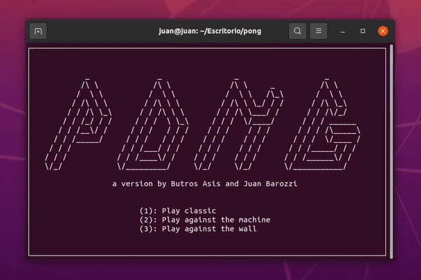

#	Pong
A terminal interface for Pong, using the [brick](https://hackage.haskell.org/package/brick) library for Haskell.  

<p align="center">
    
</p>

##	Team
-	[Butros Asis](https://github.com/ButrosAsis)
-	[Juan Ignacio Barozzi Behr](https://github.com/jibarozzibehr)

##	Installation
Windows support is questionable due to [incompatibility](https://www.reddit.com/r/haskell/comments/7tutxa/vty_needs_your_help_supporting_windows/) with the [vty](https://hackage.haskell.org/package/vty) library.  
###	Linux
First [get Cabal](https://www.haskell.org/cabal/). Then:  
```bash
git clone https://github.com/jibarozzibehr/pong
cd pong
cabal install
cabal run
```

##	Usage
Make sure your terminal window has at least a size of 80x24.  
We've fixed the size so the game won't change if you make the window bigger than that resolution.  

##	Code we found useful and helped us with this project
-	[tetris: A terminal interface for Tetris](https://github.com/samtay/tetris)
-	[snake: A terminal interface for Snake](https://github.com/samtay/snake/)
-	[Brick Tutorial by Samuel Tay](https://github.com/jtdaugherty/brick/blob/master/docs/samtay-tutorial.md)
-	[LayerDemo.hs](https://github.com/jtdaugherty/brick/blob/master/programs/LayerDemo.hs)